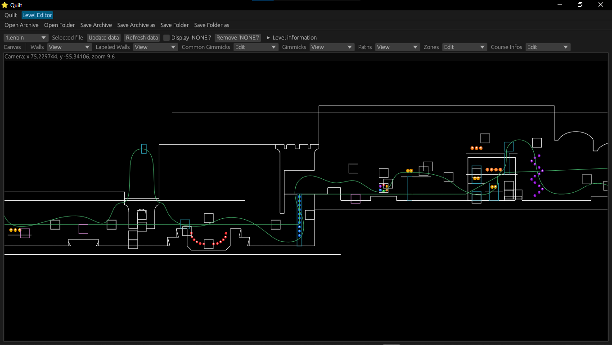
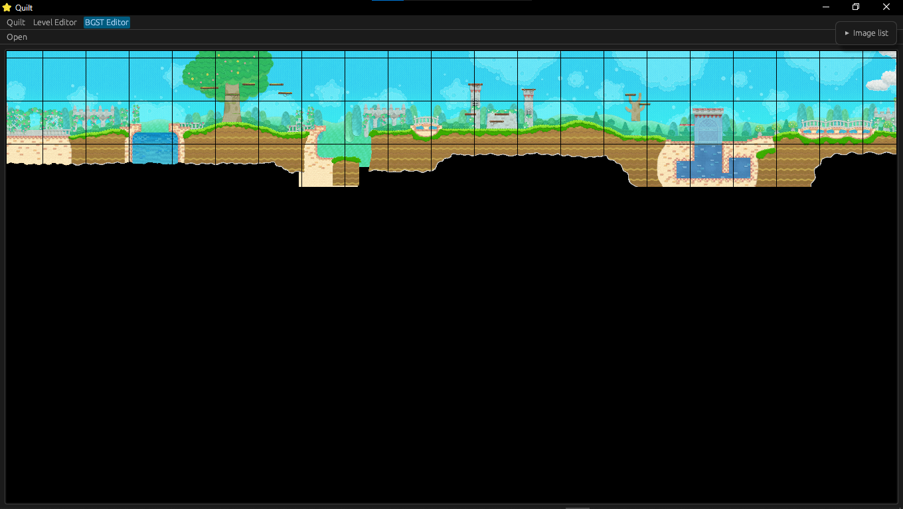

# Quilt
A <em>Kirby's Epic Yarn</em> modding tool.

## Features
- [X] Level editor
- [X] GfArch utility

### Work in Progress
- [ ] Level graphics editor

### Roadmap
- Collision editor
- MNEB rendering
- Potential <em>Kirby's Extra Epic Yarn</em> support.

## Capabilities
### Level Editor
- Open and save levels
- Edit level collisions, gimmicks, enemies, and more
- Support for images for gimmicks
- Render backgrounds for ease of editing and alignment

### Level Graphics Editor
- Open `.bgst3` files
- Render a grid

## Screenshots
### Level Editor



### Level Graphics Editor



## Setup
1. Download the latest release of Quilt or compile from source.
2. Create a folder called `quilt_res` next to the Quilt app.
3. Download the latest gimmick images for Quilt from [the Quilt image collection](https://github.com/Swiftshine/key-quilt-image). Put the `tex` folder within the `quilt_res` folder. To update your images, redownload the repository.
4. Download the latest `objectdata.json` from [the object database](https://github.com/Swiftshine/key-objectdb). This only needs to be done once, as afterwards, you can update within the app. Put this in the `quilt_res` folder.

In the end, your folder structure should look like this:
```
[folder Quilt is in]
    ├── quilt_res/
    │    ├── tex/
    │    │   └── [texture folders]
    │    └── objectdata.json
    └── [Quilt executable (Quilt.exe, etc.)]
```
